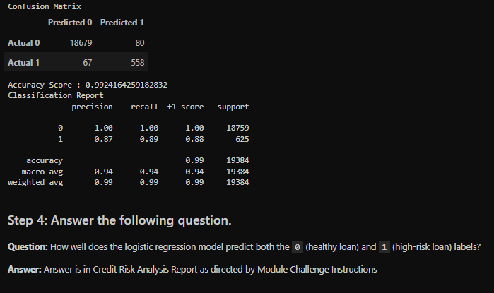

#Credit Risk Analysis

The purpose of this challenge was see how well a logistic regression model could predict a healthy loan or a high risk loan from given data.  How did it do?

*Accuracy: The accuracy score was 0.9924164259182832, which means that the model correctly predicted the target labels (0, 1) for approximately 99.24% of the data.

*Precision: For Class O (Healthy Loan), the model scored 100%, which would indicate that it when the model predicts a positive, it is likely to be correct, despite the Class 1 (High-Risk Loan) only scoring 87%.

*Recall: Recall scores were similar to the precision scores, only slightly higher for Class 1 with a score of 89%, which again would suggest the model is good at identifying positive data.

*F1 Score: The F1 scores are also similar, and although there is the lower Class 1 score, the model does seem to have a good balance when it comes to predicting positves, but keeping false positives and false negatives low.

*Macro and Weighted Averages: With scores of 94 and 99%, this further supports that the model performed well across both classes.

Overall, the model performed well and does a fairly accurate job, especially when it comes to Class 0.  It had a very high Positive prediction rate with a fairly low amount of false positives and negatives. 
